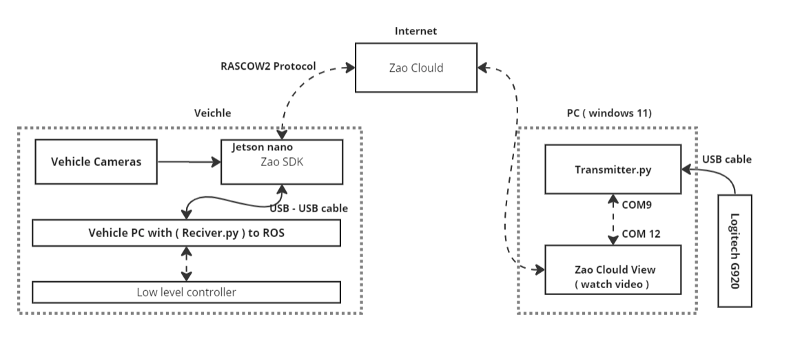

# Zao_SDK_Teleportation

## Overview
This repository is part of an experimental setup at TU Delft University to control a Toyota Prius remotely using the Logitech G920 steering wheel via the Zao SDK's serial tunneling capabilities. The experement aims to integrate different technologies to facilitate real-time communication and control between the steering hardware and the vehicle's onboard computer system.


## Project Components


- **Logitech G920 Steering Wheel**: Interface for capturing driver inputs.
- **PC with Virtual Serial Ports (for example COM9 and COM12)**: Handles the transmission of steering data and receives vehicle telemetry.
- **Zao Cloud View Application**: Relays data and video feeds between the PC and the vehicle.
- **Zao SDK on Jetson Board**: Installed in the vehicle to receive commands and control the vehicle.
- **Toyota Prius Onboard Computer**: Processes incoming commands to manipulate vehicle controls.
- **ROS (Robot Operating System)**: Used for managing communication between control scripts and vehicle hardware.

## Getting Started

### Prerequisites
- Python 3.x
- PySerial library
- USB support with libusb1
- Access to a Logitech G920 steering wheel and a Toyota Prius equipped with the necessary hardware

### Installation

1. **Clone the repository:**
   ```bash
   git clone https://github.com/yourusername/Zao_SDK_Teleportation.git
   cd Zao_SDK_Teleportation

2. **Install required Python libraries:**
   ```bash
    pip install pyserial

## Setup
content under development 

## Usage
1. **To run the transmitter script on the PC using Logitech g920:**
   ```bash
    python transmitter.py 
    # if you want to use logitech simualtor 
    python transmitter.py --simulate
2. **To run the receiver script on the Toyota Prius computer**
   ```bash
    python receiver.py